# 화면 설계서

| 항목 | 내용 |
|---|---|
| 프로젝트명 | 오늘의직관 |
| 작성자 | 이채목 |
| 작성일 | 2026-08-18 |
| 버전 | v0.1 |

## 작성 범위

전체 화면 23개 중 아래 7개를 상세 설계 대상으로 한다. 각 화면은 모바일 기준으로 작성하며, 레이아웃이 달라지는 화면의 데스크톱 배치는 8장에 별도로 기재한다. 나머지 화면은 요구사항 정의서 2장의 화면 목록으로 정의를 대신하며, 본 문서 9장에 개요만 기재한다.

| 순번 | 화면 ID | 화면명 | 선정 사유 |
|---|---|---|---|
| 1 | SCR-AUTH-001 | 로그인 | 서비스 진입점 |
| 2 | SCR-MAIN-001 | 홈 대시보드 | 사용자 상태에 따른 분기 로직 |
| 3 | SCR-GUIDE-001 | 첫 직관 가이드 | 신규 사용자 유입 경로 |
| 4 | SCR-PARK-002 | 구장 상세 | 사용자 기여 데이터의 환원 지점 |
| 5 | SCR-LOG-001 | 직관 기록 작성 | 서비스 핵심 기능, 입력 검증 최다 |
| 6 | SCR-STAT-001 | 내 전적 요약 | 집계 결과의 표시 정책 |
| 7 | SCR-MATE-002 | 동행 모집 상세 | 선착순 확정에 따른 상태 변화 |

---

## 0-1. 와이어프레임 표기 규칙

강의 지침에 따라 그레이스케일로 작성하며 레이아웃·정보 구조·동작 조건에 집중한다.
화면 내 각 요소에는 ①②③ 식별 번호를 부여하고, 아래 디스크립션 표의 NO 와 1:1로 대응시킨다.
원본은 `docs/_assets/wireframes/*.html` 이며 이미지는 같은 폴더의 PNG 이다.

## 0-2. 전 화면 공통 규칙

| 구분 | 정의 |
|---|---|
| 레이아웃 | 모바일 우선. 헤더(로고·알림·프로필) / 바디 / 하단 탭 네비게이션(홈·경기·기록·전적·마이) |
| 로딩 | 데이터 조회 중 스켈레톤 UI 표시. 버튼 액션 중에는 버튼을 비활성화하고 스피너 표시 |
| 네트워크 오류 | 하단 토스트 "네트워크 연결을 확인해 주세요" 노출. 재시도 버튼 제공 |
| 서버 오류(5xx) | 전체 화면 오류 페이지 노출. 새로고침 버튼 제공 |
| 인증 만료(401) | 토스트 "로그인이 만료되었습니다" 노출 후 SCR-AUTH-001로 이동. 이동 전 화면 경로를 보관하여 로그인 후 복귀 |
| 권한 없음(403) | 토스트 "권한이 없습니다" 노출 후 직전 화면 유지 |
| 빈 상태 | 목록이 비어 있으면 안내 문구와 다음 행동 버튼을 함께 노출 (예: "아직 기록이 없어요" + [첫 기록 남기기]) |
| 외부 데이터 표기 | 경기 정보가 표시되는 영역 하단에 `출처 표기 : statiz.co.kr / 스탯티즈` 고정 노출 (REQ-N-014) |
| 이미지 | 목록에서는 썸네일, 상세에서는 원본 로드 (REQ-N-002) |

---

## 1. SCR-AUTH-001 로그인

### 기본 정보

| 항목 | 내용 |
|---|---|
| 화면 ID | SCR-AUTH-001 |
| 화면명 | 로그인 |
| 화면 경로 | 메인 > 로그인 |
| 관련 요구사항 | REQ-F-002, REQ-F-003, REQ-F-004 |
| 버전 | v1.0 (2026-08-18) |

### 와이어프레임

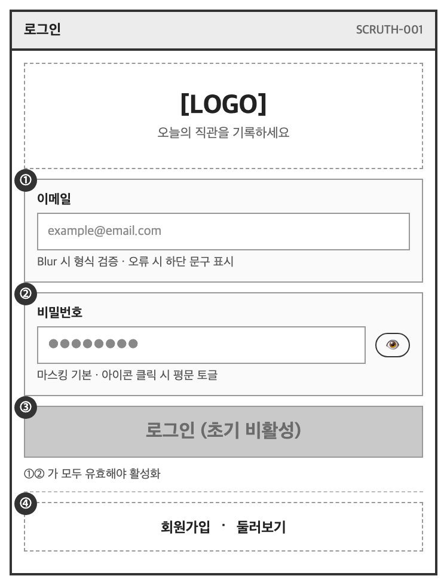

### 디스크립션

| NO | 매핑 요구사항 ID | UI 요소명 | 인터랙션 및 로직 정의 | 이동 화면 / 비고 |
|---|---|---|---|---|
| ① | REQ-F-003 | 카카오 로그인 버튼 | - 클릭 시 카카오 OAuth 인증 진행<br>- 최초 진입 시 약관 동의 및 응원팀 설정 화면으로 이동<br>- 기존 회원은 홈으로 이동 | SCR-MAIN-001<br>카카오 API 연동 |
| ② | REQ-F-002 | 이메일 입력 필드 | - PlaceHolder: example@email.com<br>- 입력 중 우측 [X] 삭제 버튼 노출<br>- Blur 시 이메일 형식 검증 | |
| ③ | REQ-F-002 | 비밀번호 입력 필드 | - PlaceHolder: 비밀번호를 입력하세요<br>- 기본 마스킹(●●●●●) 처리<br>- 우측 눈 아이콘 클릭 시 평문/마스킹 토글 | |
| ④ | REQ-F-002 | 로그인 버튼 | - 초기 상태: 비활성화(Disabled)<br>- ②, ③이 모두 유효한 형식으로 입력되면 활성화<br>- 클릭 시 로그인 API 호출 및 스피너 표시<br>- 성공 시 액세스 토큰 저장 후 이동 | SCR-MAIN-001 |
| ⑤ | REQ-F-004 | 하단 텍스트 링크 | - [비밀번호 재설정] 클릭 시 재설정 화면 이동<br>- [회원가입] 클릭 시 가입 화면 이동 | SCR-AUTH-003<br>SCR-AUTH-002 |

### 예외 처리 및 정책

| 상황 | 처리 |
|---|---|
| 이메일 형식 오류 | ② 하단에 "이메일 형식이 올바르지 않습니다" 표시. ④ 비활성 유지 |
| 계정 정보 불일치 | ③ 하단에 "이메일 또는 비밀번호가 올바르지 않습니다" 표시. 어느 쪽이 틀렸는지는 구분하여 안내하지 않는다 |
| 비밀번호 5회 연속 오류 | 캡차 인증 모달 노출. 이후 로그인 시도 시 캡차 통과 필요 |
| 미인증 계정 | "이메일 인증이 완료되지 않았습니다" 표시 및 [인증 메일 재발송] 버튼 노출 |
| 카카오 인증 취소 | 별도 안내 없이 본 화면 유지 |

---

## 2. SCR-MAIN-001 홈 대시보드

### 기본 정보

| 항목 | 내용 |
|---|---|
| 화면 ID | SCR-MAIN-001 |
| 화면명 | 홈 대시보드 |
| 화면 경로 | 메인 |
| 관련 요구사항 | REQ-F-101, REQ-F-705, REQ-F-604 |
| 버전 | v1.0 (2026-08-18) |

### 와이어프레임

**A. 기록 없는 사용자 (관람 기록 0건)**

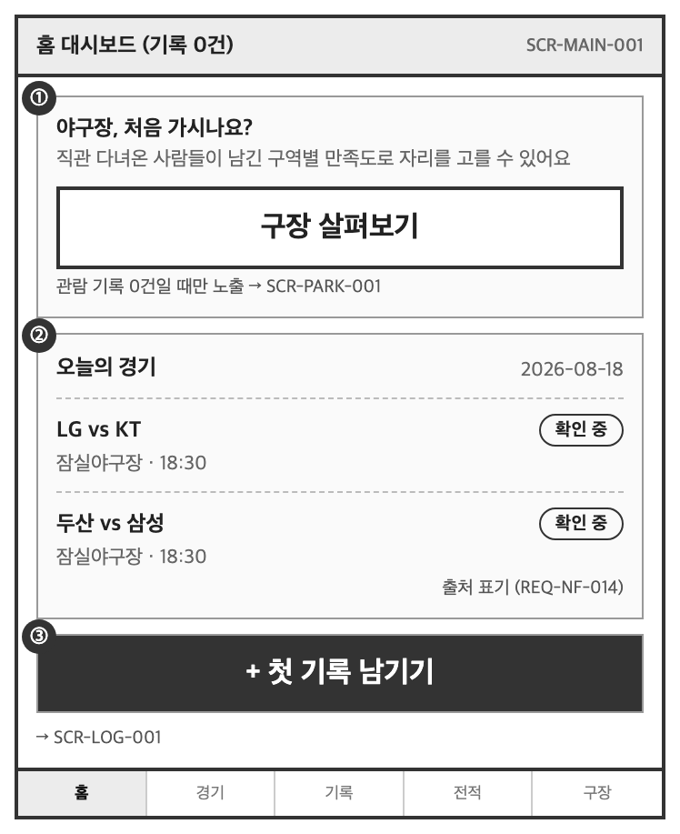

**B. 기록 있는 사용자**

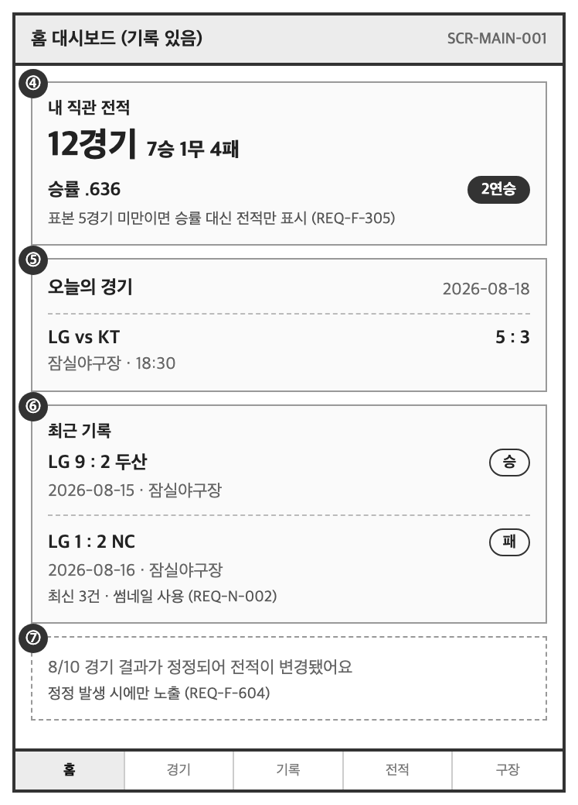

### 디스크립션

| NO | 매핑 요구사항 ID | UI 요소명 | 인터랙션 및 로직 정의 | 이동 화면 / 비고 |
|---|---|---|---|---|
| ① | REQ-F-705, REQ-F-702 | 가이드 배너 | - 관람 기록이 0건인 사용자에게만 노출<br>- 기록이 1건 이상 생기면 영역 자체를 숨김 | SCR-GUIDE-001 |
| ② ⑤ | REQ-F-101 | 오늘의 경기 카드 | - 당일 편성된 경기를 시작 시각 순으로 표시<br>- 경기 없는 날은 "오늘은 경기가 없어요" 표시<br>- 카드 클릭 시 경기 상세로 이동<br>- 영역 하단에 출처 고정 노출 | SCR-GAME-002<br>REQ-N-014 |
| ③ | REQ-F-201 | 첫 기록 유도 버튼 | - 기록 0건일 때만 노출<br>- 클릭 시 기록 작성 화면으로 이동 | SCR-LOG-001 |
| ④ | REQ-F-301, REQ-F-306 | 전적 요약 카드 | - 기록 1건 이상일 때 노출<br>- 통산 전적, 승률, 현재 연승을 표시<br>- 표본이 기준 미만이면 승률을 숨기고 전적만 표시 | SCR-STAT-001<br>REQ-F-305 |
| ⑥ | REQ-F-213 | 최근 기록 리스트 | - 최신순 최대 3건, 썸네일 사용<br>- 클릭 시 기록 상세로 이동 | SCR-LOG-003 |
| ⑦ | REQ-F-604 | 정정 알림 배너 | - 경기 결과 정정으로 본인 전적이 변경된 경우 노출<br>- 확인 시 해당 기록 상세로 이동하고 배너를 닫음 | SCR-LOG-003 |

### 예외 처리 및 정책

| 상황 | 처리 |
|---|---|
| 경기 데이터 수집 실패 | 마지막 성공 데이터를 표시하고 "정보 갱신이 지연되고 있어요" 안내 문구 노출 (REQ-N-010) |
| 비로그인 접근 | ②만 노출하고 ③④⑥⑦ 영역은 로그인 유도 카드로 대체 |
| 전적 집계 미완료 | ④ 영역을 스켈레톤으로 표시하고 완료 시 갱신 |

---

## 3. SCR-GUIDE-001 첫 직관 가이드

### 기본 정보

| 항목 | 내용 |
|---|---|
| 화면 ID | SCR-GUIDE-001 |
| 화면명 | 첫 직관 가이드 |
| 화면 경로 | 메인 > 가이드 |
| 관련 요구사항 | REQ-F-701, REQ-F-702 |
| 버전 | v1.0 (2026-08-18) |

### 와이어프레임

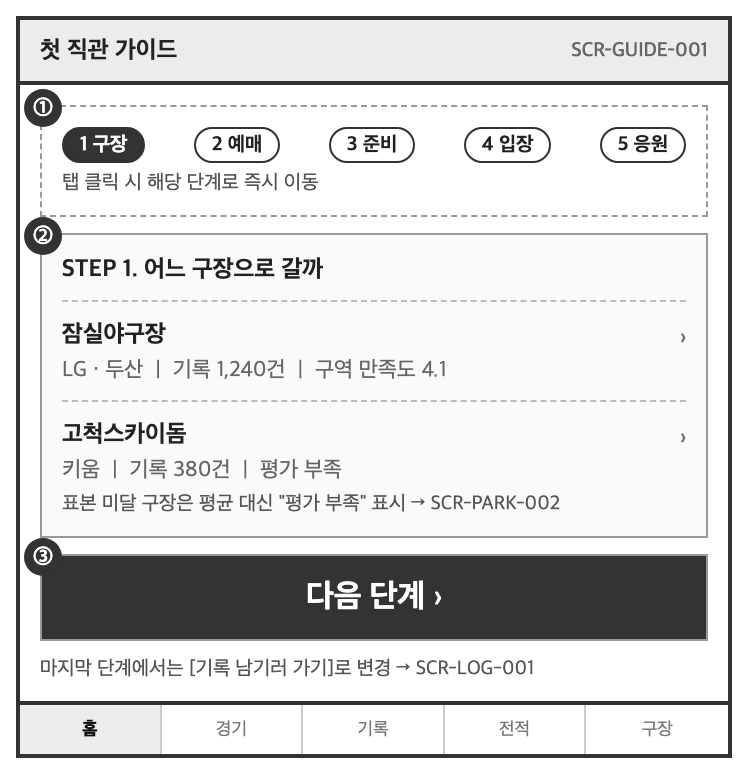

### 디스크립션

| NO | 매핑 요구사항 ID | UI 요소명 | 인터랙션 및 로직 정의 | 이동 화면 / 비고 |
|---|---|---|---|---|
| ① | REQ-F-701 | 단계 탭 | - 5단계(구장 / 예매 / 준비물 / 입장 / 응원)를 탭으로 제공<br>- 현재 단계를 강조 표시<br>- 탭 클릭 시 해당 단계로 즉시 이동 | 스크롤 없이 단계 이동 가능 |
| ② | REQ-F-702 | 구장 카드 리스트 | - 구장별 홈 구단, 누적 기록 수, 구역 만족도 평균을 표시<br>- 만족도는 표본 수가 기준 미만이면 "-"로 표시<br>- 클릭 시 구장 상세로 이동 | SCR-PARK-002<br>REQ-F-110 |
| ③ | REQ-F-701 | 다음 단계 버튼 | - 다음 단계로 이동<br>- 마지막 단계에서는 [기록 남기러 가기]로 문구와 동작이 변경 | SCR-LOG-001 |

### 예외 처리 및 정책

| 상황 | 처리 |
|---|---|
| 구역 만족도 표본 부족 | 평균 점수 대신 "평가 데이터가 아직 부족해요" 표시 (REQ-F-305 동일 정책) |
| 비로그인 접근 | 전체 열람 가능. ③의 기록 작성 이동 시에만 로그인 요구 |
| 가이드 재진입 | 기록이 있는 사용자도 하단 탭이나 마이페이지를 통해 언제든 재진입 가능 |

---

## 4. SCR-PARK-002 구장 상세

### 기본 정보

| 항목 | 내용 |
|---|---|
| 화면 ID | SCR-PARK-002 |
| 화면명 | 구장 상세 |
| 화면 경로 | 메인 > 구장 > 상세 |
| 관련 요구사항 | REQ-F-109, REQ-F-110, REQ-F-111 |
| 버전 | v1.0 (2026-08-18) |

### 와이어프레임

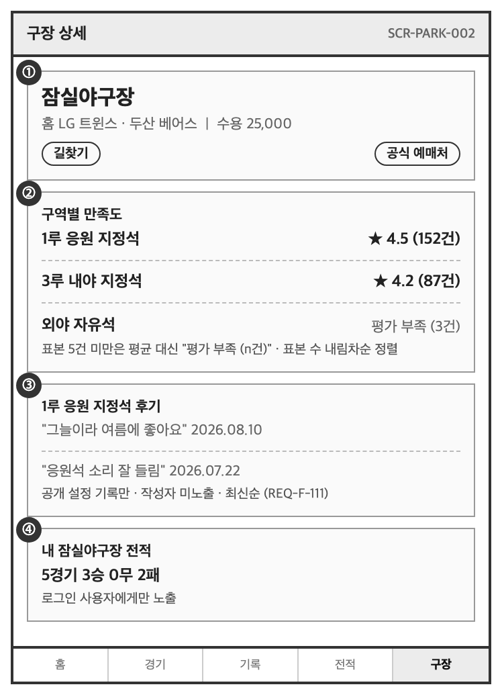

### 디스크립션

| NO | 매핑 요구사항 ID | UI 요소명 | 인터랙션 및 로직 정의 | 이동 화면 / 비고 |
|---|---|---|---|---|
| ① | REQ-F-109, REQ-F-114 | 구장 기본 정보 | - 홈 구단, 수용 인원, 주소를 표시<br>- [길찾기] 클릭 시 외부 지도 앱 호출<br>- [공식 예매처] [홈페이지] [인스타그램] 클릭 시 외부 브라우저로 이동<br>- 링크가 없는 채널은 버튼을 노출하지 않는다 | 외부 링크는 새 창<br>임베드가 아닌 링크만 제공 |
| ② | REQ-F-110 | 구역별 만족도 리스트 | - 구역 단위 평균 점수와 표본 수를 함께 표시<br>- 표본이 기준(5건) 미만이면 평균 대신 "평가 부족 (n건)" 표시<br>- 기본 정렬은 표본 수 내림차순<br>- 구역 클릭 시 ③ 영역이 해당 구역 후기로 전환 | REQ-F-305 동일 정책 |
| ③ | REQ-F-111 | 구역별 후기 | - 선택된 구역의 공개 기록 메모를 최신순 표시<br>- 비공개 설정 기록은 제외<br>- 작성자는 노출하지 않고 작성일만 표시<br>- [더보기] 클릭 시 목록 확장 | REQ-F-208 |
| ④ | REQ-F-302 | 내 구장 전적 | - 로그인 사용자에게만 노출<br>- 해당 구장에서의 개인 전적 표시<br>- 기록이 없으면 "아직 이 구장 기록이 없어요" 표시 | SCR-STAT-002 |

### 예외 처리 및 정책

| 상황 | 처리 |
|---|---|
| 전체 구역 표본 부족 | ② 영역에 "이 구장은 아직 평가가 쌓이지 않았어요. 첫 기록을 남겨주세요" 안내와 [기록 남기기] 버튼 노출 |
| 후기 없음 | ③ 영역 숨김 |
| 비공개 기록만 존재 | 만족도 점수는 익명으로 집계에 반영하되(REQ-F-208), 후기 본문은 노출하지 않는다 |
| 비로그인 접근 | ①②③ 열람 가능, ④ 영역은 로그인 유도로 대체 |

---

## 5. SCR-LOG-001 직관 기록 작성

### 기본 정보

| 항목 | 내용 |
|---|---|
| 화면 ID | SCR-LOG-001 |
| 화면명 | 직관 기록 작성 · 수정 |
| 화면 경로 | 메인 > 내 기록 > 작성 |
| 관련 요구사항 | REQ-F-201 ~ REQ-F-212 |
| 버전 | v1.0 (2026-08-18) |

### 와이어프레임

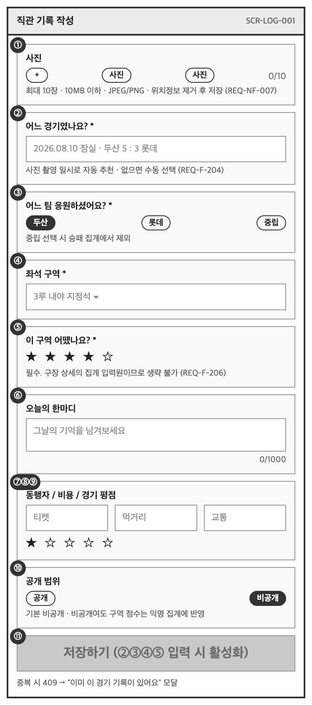

### 디스크립션

| NO | 매핑 요구사항 ID | UI 요소명 | 인터랙션 및 로직 정의 | 이동 화면 / 비고 |
|---|---|---|---|---|
| ① | REQ-F-203, REQ-F-204 | 사진 업로드 | - 최대 10장, 1장당 10MB 이하, JPG/PNG/HEIC<br>- 업로드 시 위치 메타데이터를 제거하고 썸네일을 생성<br>- 첫 장 업로드 시 촬영 일시를 읽어 ②의 경기 후보를 자동 조회<br>- 각 사진 길게 누르면 삭제 | REQ-N-002, REQ-N-007 |
| ② | REQ-F-201, REQ-F-204 | 경기 선택 | - 사진 촬영 일시로 추정된 경기를 기본 선택하고 "사진에서 찾은 경기예요" 안내 표시<br>- 메타데이터가 없거나 후보가 없으면 날짜 선택 후 목록에서 수동 선택<br>- [변경] 클릭 시 경기 검색 모달 노출<br>- **필수 항목** | 미선택 시 ⑪ 비활성 |
| ③ | REQ-F-202 | 응원팀 선택 | - 선택된 경기의 양 팀과 "중립"을 라디오로 제공<br>- 기본값은 사용자 프로필의 응원팀이 양 팀에 포함된 경우 자동 선택<br>- 중립 선택 시 승패 집계에서 제외됨을 안내 문구로 표시<br>- **필수 항목** | REQ-F-301 |
| ④ | REQ-F-205 | 좌석 구역 선택 | - 선택된 경기의 구장에 등록된 구역 목록을 드롭다운으로 제공<br>- 구장이 바뀌면 선택값을 초기화<br>- **필수 항목** | REQ-F-605 |
| ⑤ | REQ-F-206 | 구역 만족도 | - 5점 척도 별점<br>- ④ 선택 전에는 비활성<br>- **필수 항목** — 구장 상세의 집계 입력원이므로 생략을 허용하지 않는다 | REQ-F-110 |
| ⑥ | REQ-F-207 | 메모 | - 최대 1000자, 실시간 글자 수 표시<br>- 1000자 초과 입력은 차단 | |
| ⑦ | REQ-F-209 | 동행자 | - [+ 추가] 클릭 시 회원 검색 또는 이름 직접 입력 선택<br>- 최대 10명 | |
| ⑧ | REQ-F-210 | 관람 비용 | - 티켓 / 먹거리 / 교통을 각각 숫자 입력<br>- 0 이상 정수만 허용, 미입력 허용 | |
| ⑨ | REQ-F-211 | 경기 평점 | - 5점 척도 별점, 미입력 허용 | |
| ⑩ | REQ-F-208 | 공개 범위 | - 기본값 비공개<br>- 공개 선택 시 "메모가 구장 후기에 노출됩니다" 안내 표시<br>- 비공개여도 ⑤ 점수는 익명으로 집계에 반영됨을 명시 | REQ-F-111 |
| ⑪ | REQ-F-201, REQ-F-212 | 저장 버튼 | - 초기 상태: 비활성화<br>- ②③④⑤가 모두 입력되면 활성화<br>- 클릭 시 저장 API 호출, 중복 제출 방지를 위해 버튼 비활성 및 스피너 표시<br>- 성공 시 기록 상세로 이동하고 전적 재집계를 트리거 | SCR-LOG-003<br>REQ-F-309 |

### 예외 처리 및 정책

| 상황 | 처리 |
|---|---|
| 동일 경기 기록 중복 | 저장 시 409 응답. "이미 이 경기 기록이 있어요" 모달 노출 후 [기존 기록 보기] / [취소] 선택 (REQ-F-201) |
| 사진 용량 초과 | 해당 파일만 업로드하지 않고 "10MB 이하 파일만 올릴 수 있어요" 토스트. 나머지 파일은 정상 처리 |
| 미지원 파일 형식 | "지원하지 않는 형식이에요" 토스트 |
| 촬영 일시 없음 | 자동 매칭을 시도하지 않고 ② 영역을 수동 선택 상태로 표시 |
| 촬영 일시 해당일에 경기 없음 | "그날 경기를 찾지 못했어요. 직접 선택해 주세요" 안내 |
| 미래 경기 선택 | 아직 시작하지 않은 경기는 선택 목록에서 제외 |
| 작성 중 이탈 | [×] 클릭 시 "작성 중인 내용이 사라져요" 확인 모달 노출 |
| 저장 실패 | 입력값을 유지한 채 "저장에 실패했어요. 다시 시도해 주세요" 토스트 |

---

## 6. SCR-STAT-001 내 전적 요약

### 기본 정보

| 항목 | 내용 |
|---|---|
| 화면 ID | SCR-STAT-001 |
| 화면명 | 내 전적 요약 |
| 화면 경로 | 메인 > 전적 |
| 관련 요구사항 | REQ-F-301, REQ-F-305, REQ-F-306 |
| 버전 | v1.0 (2026-08-18) |

### 와이어프레임

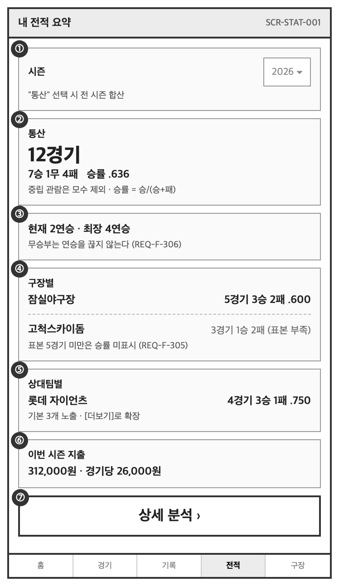

### 디스크립션

| NO | 매핑 요구사항 ID | UI 요소명 | 인터랙션 및 로직 정의 | 이동 화면 / 비고 |
|---|---|---|---|---|
| ① | REQ-F-304 | 시즌 선택 | - 기본값은 현재 시즌<br>- "통산"을 선택하면 전 시즌 합산으로 전환<br>- 기록이 있는 시즌만 목록에 표시 | |
| ② | REQ-F-301 | 통산 전적 | - 중립 관람 기록은 모수에서 제외하고, 제외 건수를 하단에 작게 표시<br>- 승률은 소수 셋째 자리까지 표시하며 앞자리 0을 생략(.636) | 야구 표기 관례 |
| ③ | REQ-F-306 | 연승 기록 | - 관람 일자 순으로 현재 연승과 최장 연승을 표시<br>- 무승부는 연승을 끊지 않고 유지하는 것으로 처리 | 규칙을 화면에 툴팁으로 안내 |
| ④ | REQ-F-302, REQ-F-305 | 구장별 전적 | - 표본이 5경기 미만인 구장은 **승률을 표시하지 않고** 전적만 표시하며 "(표본 부족)"을 병기<br>- 정렬은 경기 수 내림차순<br>- 항목 클릭 시 해당 구장 상세로 이동 | SCR-PARK-002 |
| ⑤ | REQ-F-303, REQ-F-305 | 상대팀별 전적 | - ④와 동일한 표시 정책 적용<br>- 기본 3개 노출, [더보기]로 전체 확장 | |
| ⑥ | REQ-F-308 | 지출 집계 | - 비용을 입력한 기록만 대상으로 집계<br>- 미입력 기록이 있으면 "n건은 비용 미입력" 표시 | REQ-F-210 |
| ⑦ | REQ-F-304, REQ-F-307 | 상세 분석 이동 | - 요일별, 동행자별 등 세부 집계 화면으로 이동 | SCR-STAT-002 |

### 예외 처리 및 정책

| 상황 | 처리 |
|---|---|
| **소표본 표시 정책** | 전체 화면 공통 규칙. 표본 5경기 미만 항목은 승률·순위를 산출하지 않고 실제 전적만 표시한다. 2경기 2승을 "승률 1.000"으로 표시하면 통계적으로 오해를 유발하기 때문이다 (REQ-F-305) |
| 기록 0건 | "아직 기록이 없어요" 안내와 [첫 기록 남기기] 버튼 노출 |
| 중립 관람만 존재 | 승패 집계 불가 안내와 함께 관람 경기 수만 표시 |
| 집계 재계산 진행 중 | 마지막 집계 결과와 함께 "전적을 다시 계산하고 있어요" 안내 표시 (REQ-F-309) |
| 경기 결과 정정 발생 | 재계산 완료 후 변경된 항목에 배지 표시 (REQ-F-604) |

---

## 7. SCR-MATE-002 동행 모집 상세

### 기본 정보

| 항목 | 내용 |
|---|---|
| 화면 ID | SCR-MATE-002 |
| 화면명 | 동행 모집 상세 |
| 화면 경로 | 메인 > 동행 > 상세 |
| 관련 요구사항 | REQ-F-501 ~ REQ-F-506 |
| 버전 | v1.0 (2026-08-18) |

### 와이어프레임

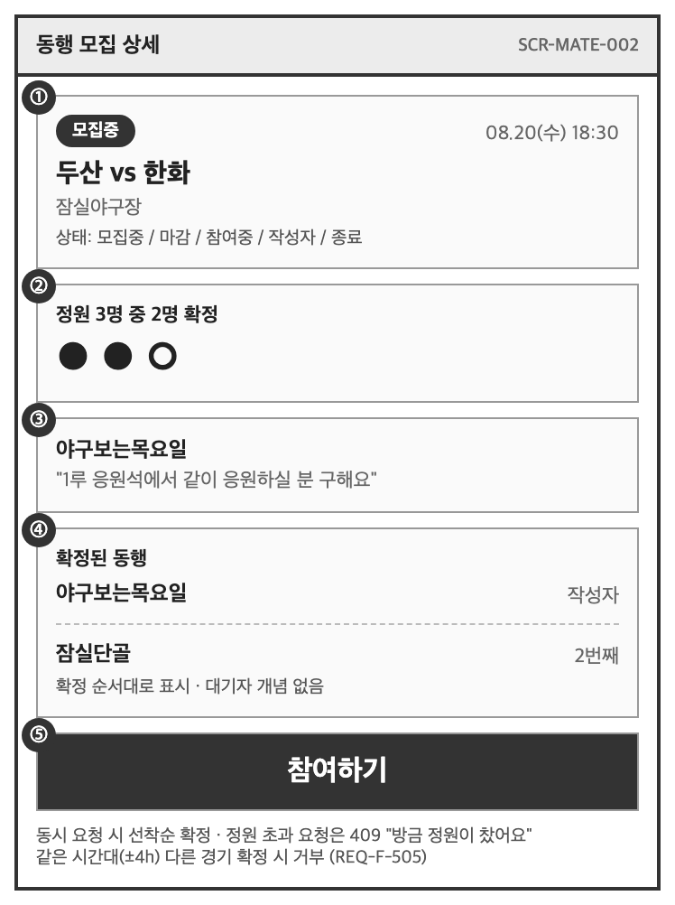

```
┌─────────────────────────────┐
│ ←        동행 모집           │
├─────────────────────────────┤
│ ① [모집중]                   │
│    08.20(수) 18:30 잠실      │
│    두산 vs 한화              │
├─────────────────────────────┤
│ ② 정원 3명 중 2명 확정       │
│    ●●○                      │
├─────────────────────────────┤
│ ③ 작성자  야구보는목요일      │
│    "1루 응원석에서 같이       │
│     응원하실 분 구해요"       │
├─────────────────────────────┤
│ ④ 확정된 동행                │
│    · 야구보는목요일 (작성자)  │
│    · 잠실단골                │
├─────────────────────────────┤
│ ⑤        참여하기            │
└─────────────────────────────┘
```

### 상태 정의

| 상태 | 조건 | ⑤ 버튼 표시 |
|---|---|---|
| 모집중 | 확정 인원 < 정원, 경기 시작 전 | [참여하기] 활성 |
| 마감 | 확정 인원 = 정원 | [정원이 찼어요] 비활성 |
| 참여중 | 본인이 확정된 상태 | [참여 취소] |
| 작성자 | 본인이 등록한 모집 | [모집 마감하기] |
| 종료 | 경기 시작 시각 경과 | [종료된 모집] 비활성 |

### 디스크립션

| NO | 매핑 요구사항 ID | UI 요소명 | 인터랙션 및 로직 정의 | 이동 화면 / 비고 |
|---|---|---|---|---|
| ① | REQ-F-502 | 상태 배지 및 경기 정보 | - 위 상태 정의에 따른 배지 표시<br>- 경기 정보 클릭 시 경기 상세로 이동 | SCR-GAME-002 |
| ② | REQ-F-504 | 정원 현황 | - 확정 인원 / 정원을 숫자와 도트로 표시<br>- 다른 사용자의 확정으로 값이 변하면 화면 재진입 시 갱신 | |
| ③ | REQ-F-501 | 작성자 및 소개글 | - 작성자 닉네임과 소개글 표시<br>- 닉네임 클릭 시 공개 프로필로 이동 | |
| ④ | REQ-F-504 | 확정자 목록 | - 확정된 사용자를 확정 순서대로 표시<br>- 대기자 개념은 두지 않는다 | |
| ⑤ | REQ-F-503 ~ 506 | 참여 버튼 | - 클릭 시 즉시 확정 요청. 중복 클릭 방지를 위해 응답 전까지 비활성<br>- **서버는 정원 초과 확정이 발생하지 않도록 처리하며, 동시 요청 시 선착순으로 확정한다**<br>- 성공 시 상태를 참여중으로 전환하고 ②④를 갱신<br>- 참여 취소 시 확인 모달을 거친 뒤 자리를 모집중으로 되돌린다 | REQ-N-011 |

### 예외 처리 및 정책

| 상황 | 처리 |
|---|---|
| **동시 요청으로 정원 초과** | 늦게 도착한 요청은 409 응답. "방금 정원이 찼어요" 모달 노출 후 화면을 마감 상태로 갱신한다. 서버는 정원을 초과한 확정을 저장하지 않는다 (REQ-F-504, REQ-N-011) |
| 동일 시간대 중복 참여 | 같은 시간대 다른 경기에 이미 확정된 경우 "같은 시간에 확정된 동행이 있어요" 안내 후 지원 거부 (REQ-F-505) |
| 본인 모집에 참여 시도 | [참여하기] 대신 [모집 마감하기] 노출 (REQ-F-503) |
| 경기 시작 24시간 이내 취소 | "경기 임박 시에는 취소할 수 없어요" 안내 후 차단 (REQ-F-506) |
| 경기 시작 시각 경과 | 상태를 종료로 전환하고 모든 액션을 차단 |
| 비로그인 참여 시도 | 로그인 화면으로 이동 후 복귀 |
| 확정 후 대화 진입 | 확정 상태에서만 [대화방] 진입 버튼 노출 → SCR-MATE-003 (REQ-F-511) |
| 신고 | 모집 글·댓글·확정자에 대해 신고 가능 (REQ-F-508) | 

---

## 8. 데스크톱 레이아웃 (반응형)

REQ-N-012에 따라 모바일을 기본으로 설계하되, 넓은 화면에서는 정보 밀도를 높이는 방향으로 전환한다.
아래 규칙은 전 화면에 공통으로 적용한다.

| 구분 | 모바일 (< 768px) | 데스크톱 (>= 768px) |
|---|---|---|
| 컨테이너 폭 | 480px | 1080px |
| 내비게이션 | 하단 고정 탭 | 헤더 하단 가로 탭 |
| 본문 배치 | 1단 세로 스크롤 | 3단 그리드 (1024px 이상 3단, 768~1023px 2단) |
| 주요 액션 버튼 | 가로 전폭 | 최대 320px |
| 전적 요약 카드 | 일반 카드 | 가로 전폭 (`grid-column: 1 / -1`) |

**폼 성격의 화면(SCR-AUTH-001 로그인, SCR-AUTH-002 회원가입, SCR-LOG-001 기록 작성)은
데스크톱에서도 단일 컬럼을 유지한다.** 입력 순서가 곧 작성 흐름이므로 다단으로 나누면
사용자가 순서를 잃는다. 따라서 아래에는 레이아웃이 실제로 달라지는 3개 화면만 기재한다.

### 8.1 SCR-MAIN-001 홈 대시보드 — 데스크톱

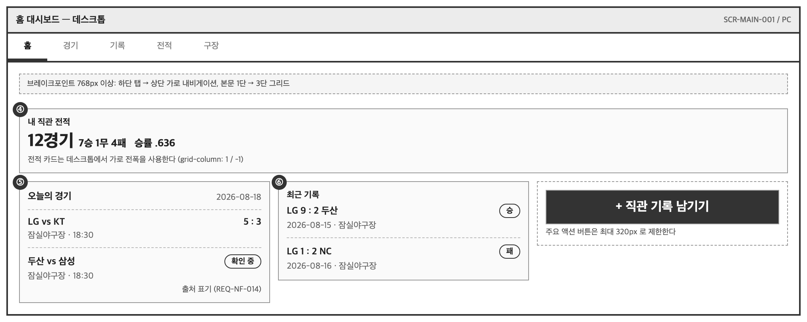

### 8.2 SCR-STAT-001 내 전적 요약 — 데스크톱

모바일에서 세로로 쌓이던 차원별 집계(통산 / 구장별 / 상대팀별)를 나란히 배치한다.

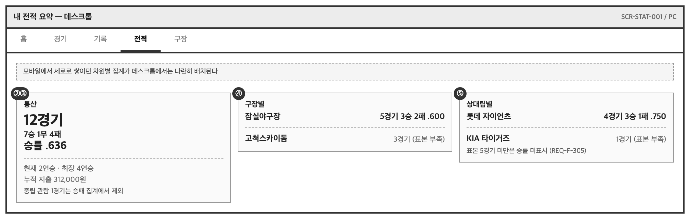

### 8.3 SCR-PARK-002 구장 상세 — 데스크톱

구역 목록과 선택한 구역의 후기를 좌우로 동시에 노출한다.
모바일에서는 구역을 선택해야 아래로 스크롤해 후기를 볼 수 있었던 흐름이,
데스크톱에서는 한 화면에서 비교 가능해진다.

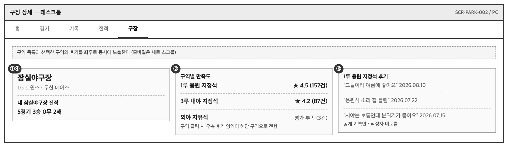

---

## 9. 추적성 확인

| 화면 ID | 매핑된 요구사항 ID |
|---|---|
| SCR-AUTH-001 | REQ-F-002, REQ-F-003, REQ-F-004 |
| SCR-MAIN-001 | REQ-F-101, REQ-F-201, REQ-F-213, REQ-F-301, REQ-F-306, REQ-F-604, REQ-F-702, REQ-F-705 |
| SCR-GUIDE-001 | REQ-F-701, REQ-F-702 |
| SCR-PARK-002 | REQ-F-109, REQ-F-110, REQ-F-111, REQ-F-302 |
| SCR-LOG-001 | REQ-F-201 ~ REQ-F-212, REQ-F-309 |
| SCR-STAT-001 | REQ-F-301 ~ REQ-F-308 |
| SCR-MATE-002 | REQ-F-501 ~ REQ-F-506 |

## 10. 상세 설계 미작성 화면

아래 화면은 요구사항 정의서 2장에 화면 ID와 경로가 정의되어 있으며, 본 프로젝트 기간 내
**상세 설계는 작성하지 않는다.** 상세 설계를 쓰지 않았다는 것과 구현하지 않았다는 것은
다르므로, 구현 여부를 함께 표시한다.

| 화면 ID | 화면명 | 개요 | 구현 |
|---|---|---|---|
| SCR-AUTH-002 | 회원가입 | 이메일·비밀번호·닉네임 입력, 응원팀 설정 | 완료 |
| SCR-AUTH-003 | 비밀번호 재설정 | 이메일 입력 후 재설정 링크 발송 | 미구현 |
| SCR-AUTH-004 | 소셜 로그인 콜백 | 인가 코드 수신·검증 후 로그인 처리, 응원팀 미설정 시 마이페이지로 유도 | 완료 |
| SCR-GAME-001 | 경기 일정 · 결과 | 날짜·팀·구장 필터, 일자별 목록 | 완료 |
| SCR-GAME-002 | 경기 상세 | 대진, 스코어, 구장 날씨·우천 가능성, 구단 공식 채널 링크, 기록 작성 진입 | 미구현 |
| SCR-GAME-003 | 팀 순위 | 등록된 결과로 산출한 승률·승차 순위표 | 완료 |
| SCR-GAME-004 | 실시간 스코어보드 | 조건부 기능. 기본은 비활성 안내 상태 | 미구현 |
| SCR-PARK-001 | 구장 목록 | 전체 구장 카드 목록 | 완료 |
| SCR-LOG-002 | 내 기록 목록 | 연도·구장·팀 필터 | 완료 |
| SCR-LOG-003 | 기록 상세 | 기록 전체 내용, 사진 뷰어, 삭제 | 완료 |
| SCR-STAT-002 | 전적 상세 분석 | 요일별·동행자별 집계 | 미구현 |
| SCR-MATE-001 | 동행 모집 목록 | 경기일·구장 필터 | 완료 |
| SCR-PLAN-001 | 관람 계획 편성 | 제약 조건 입력 및 후보 일정 제안 | 완료 |
| SCR-MATE-003 | 동행 대화방 | 확정자 전용 비공개 대화. 경기 종료 후 읽기 전용 전환 | 완료 |
| SCR-NOTI-001 | 알림 목록 | 결과 정정 · 동행 확정 · 배지 획득 알림, 읽음 처리 | 완료 |
| SCR-MY-001 | 마이페이지 · 배지 | 프로필, 응원팀 변경, 획득 배지, 차단 목록, 연결된 소셜 계정 | 완료 |
| SCR-GUIDE-001 | 첫 직관 가이드 | 상세 설계는 5장에 작성 | 완료 |
| SCR-ADM-001 | 운영자 · 경기 데이터 관리 | 제보 검토·결과 정정·경기 등록·구장 및 구역 관리 | 완료 |

### 10.1 SCR-AUTH-004 소셜 로그인 콜백 처리 규칙

상세 설계는 작성하지 않았으나, 화면이 아니라 **처리 규칙**에 가까운 부분이라 동작만 정리한다.

| 상황 | 처리 |
|---|---|
| 사용자가 동의 화면에서 취소 | "○○ 로그인을 취소했어요" 안내 후 로그인 화면 복귀 링크 |
| 인가 코드 없음 | "인증 정보가 없어요" 안내 |
| 보관한 `state` 와 응답 `state` 불일치 | "인증 요청이 확인되지 않았어요" 안내. 이 브라우저에서 시작한 요청이 아니므로 진행하지 않는다 |
| 정상 · 응원팀 있음 | 원래 가려던 경로로 복귀 |
| 정상 · 응원팀 없음 | 마이페이지로 보내 응원팀부터 고르게 한다. 전적 판정 기준이 되기 때문이다 |

### 10.2 SCR-ADM-001 운영자 화면 구성

| 탭 | 내용 |
|---|---|
| 제보 검토 | 시작했으나 결과 미확정인 경기 목록 + 스코어별 제보 집계. 최다 일치 제보를 정정 폼 기본값으로 채운다 |
| 경기 등록 | 일시·구장·홈·원정 입력. 홈=원정 및 같은 날 같은 구장 중복은 거부 |
| 구장 · 구역 | 구역 추가·이름 변경·비활성화. 관람 기록이 0건인 구역만 삭제 버튼이 노출된다 |

권한이 없는 사용자는 좌측 메뉴에 항목이 표시되지 않으며, 주소로 직접 진입해도 잠금 안내만 보인다.
