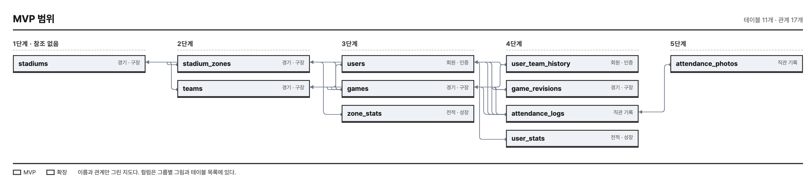
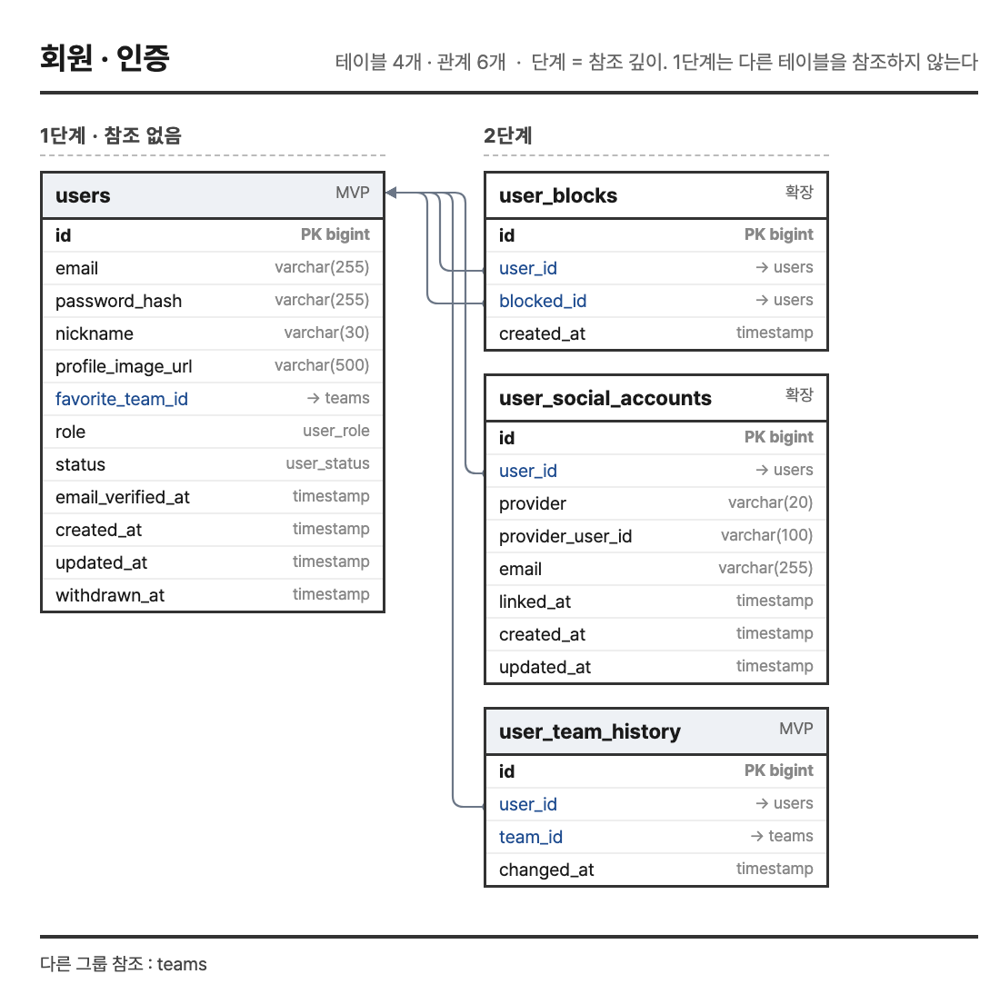
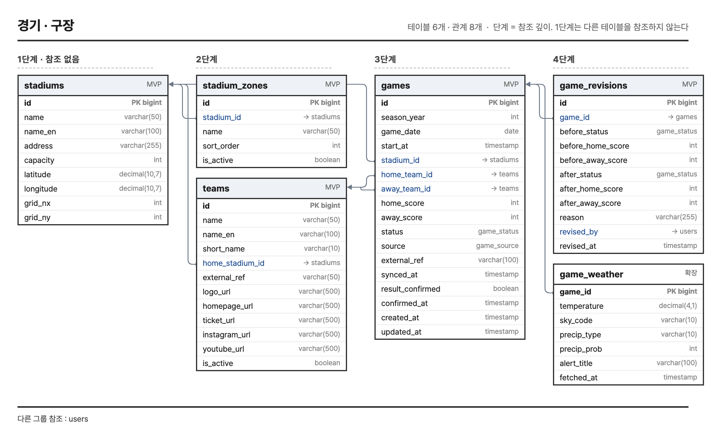
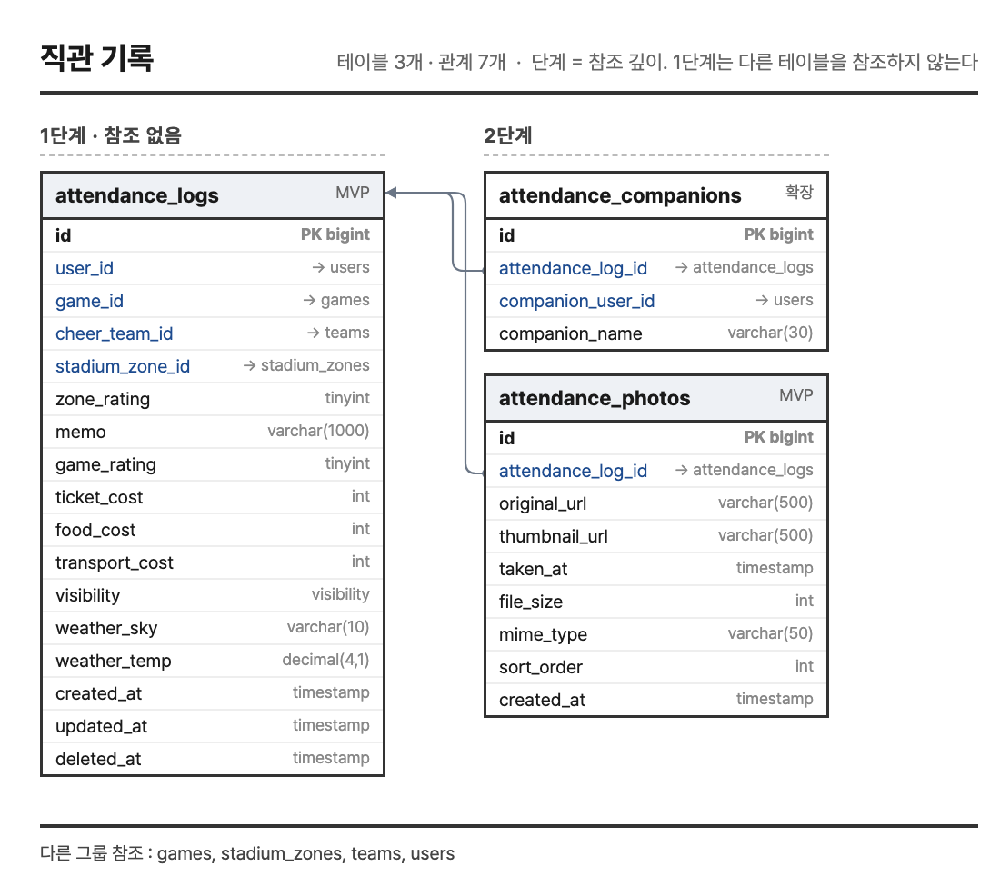
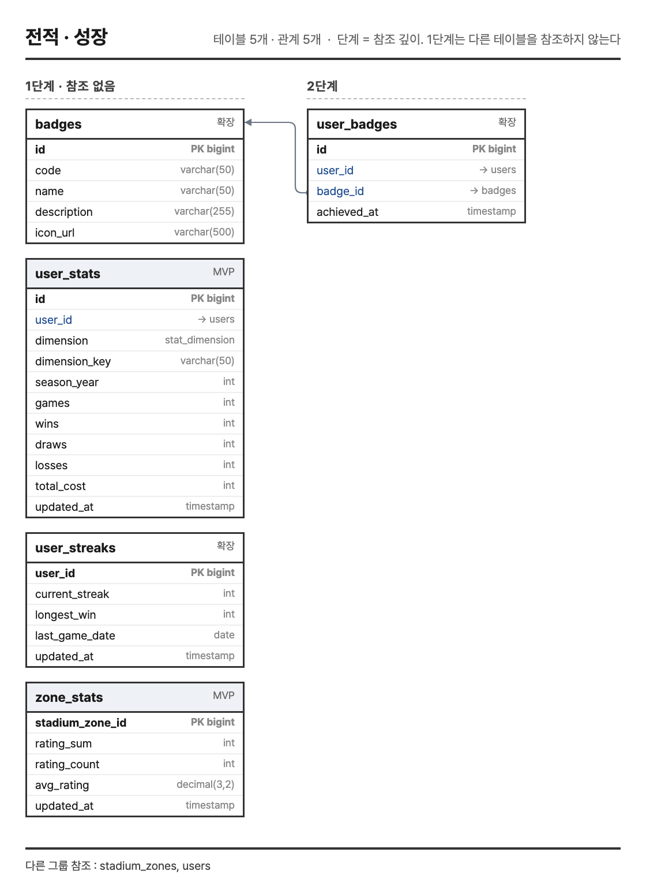
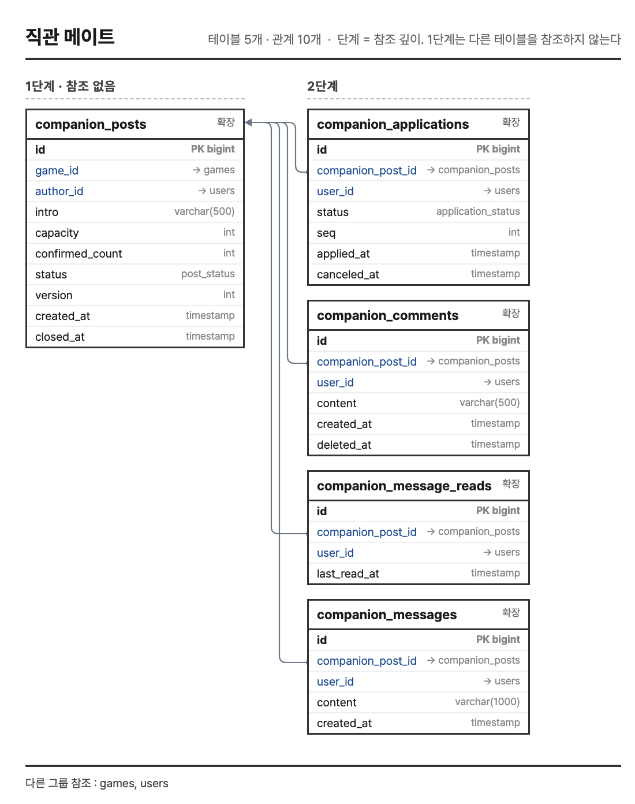
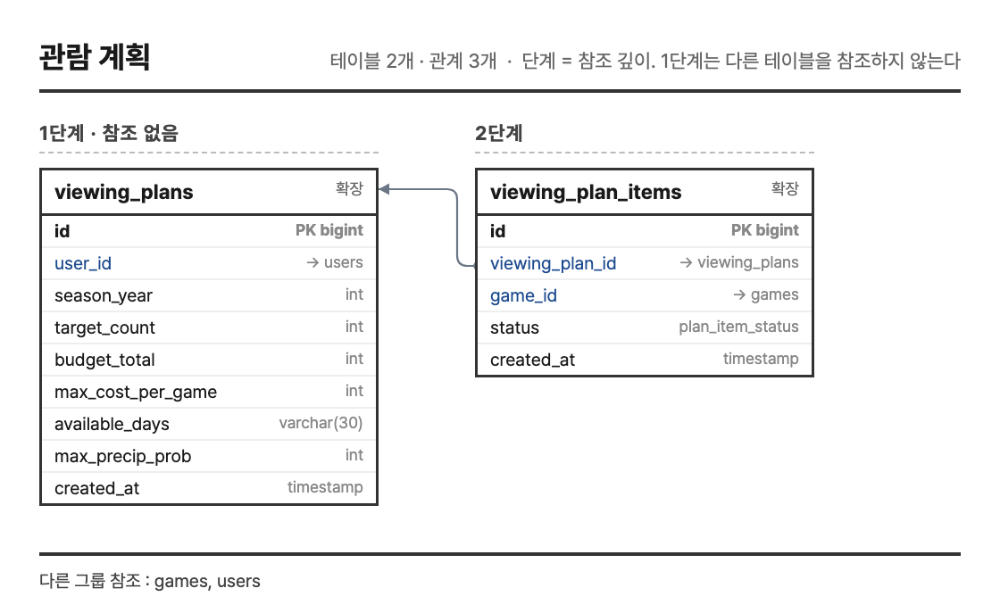
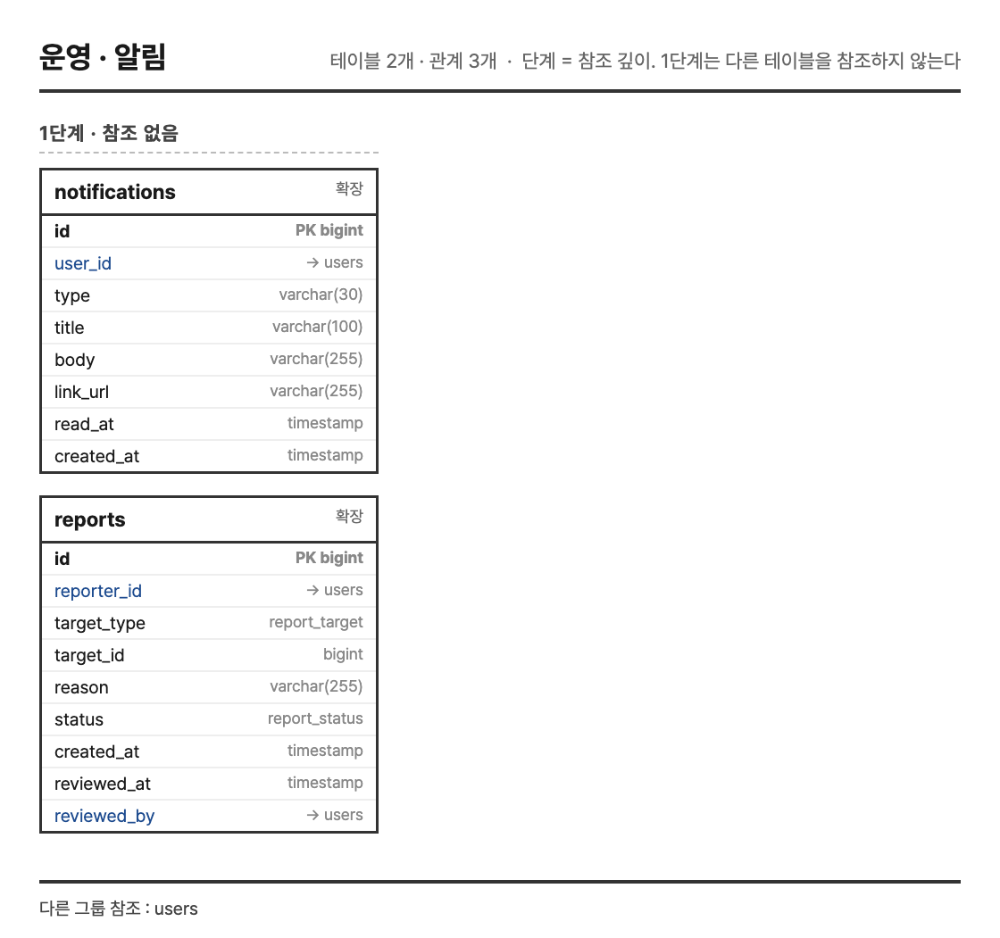
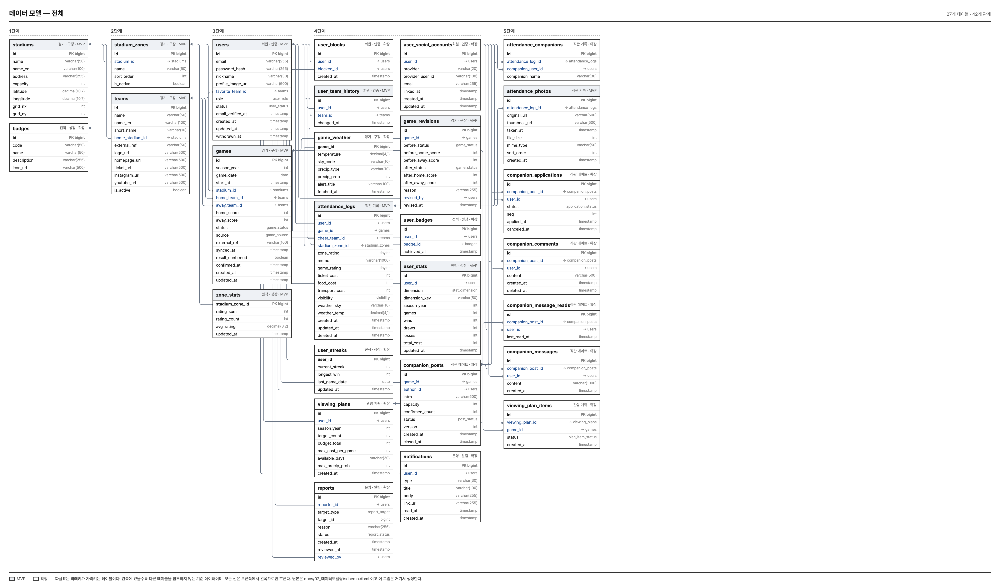

# 데이터 모델

| 항목 | 내용 |
|---|---|
| 프로젝트명 | 오늘의직관 — KBO 직관 기록 서비스 |
| 작성자 | 울산 U133 이채목 |
| 작성일 | 2026-08-18 |
| 최종 수정일 | 2026-08-19 |
| 버전 | v1.2 |
| 원본 | `docs/02_데이터모델링/schema.dbml` (DBML) |

### 개정 이력

| 버전 | 일자 | 내용 |
|---|---|---|
| v0.1 | 2026-08-18 | 요구사항 정의서와 화면 설계서를 바탕으로 초안 작성 |
| v0.2 | 2026-08-19 | 사용자 제보 기반 결과 확정을 제거하고 미사용 테이블 정리. 27개 테이블로 확정 |
| v1.0 | 2026-08-19 | 테이블마다 MVP · 확장 범위를 표시하고 인덱스를 명시 |
| v1.1 | 2026-08-19 | 이 장을 기술서 본문에 추가 |
| v1.2 | 2026-08-19 | ERD 를 기능 그룹별 · MVP 범위 · 전체 관계 세 가지로 나눠 수록 |

이 장의 그림과 테이블 목록은 `schema.dbml` 에서 생성한다. 원본을 고치면 함께 바뀌므로 문서와
모델이 따로 놀지 않는다. dbdiagram.io 에 원본을 붙여넣으면 같은 내용을 편집기에서 볼 수 있다.

---

## 1. 모델링 방침

| 항목 | 내용 |
|---|---|
| 정규화 | 3정규형을 기본으로 한다. 집계 테이블 세 개만 의도적으로 비정규화했다 |
| 이름 | 테이블은 복수형 스네이크 케이스, 외래키는 `<대상 단수>_id` |
| 키 | 대리키 `id bigint` 를 쓴다. 자연키는 유일 제약으로 따로 건다 |
| 시각 | 생성 · 수정 시각을 두고 사용자 데이터는 `deleted_at` 으로 지운 표시만 한다 |
| 열거 | 상태 값은 DB Enum 으로 둔다. 값이 늘 때 마이그레이션으로 드러나게 하려는 것이다 |

**집계 테이블을 둔 이유.** `user_stats` · `user_streaks` · `zone_stats` 는 원시 기록에서 계산할 수 있는 값이다.
그럼에도 따로 두는 것은 REQ-NF-003 때문이다. 전적 화면은 사용자가 자주 여는데 매번 기록 전체를 훑으면
기록이 쌓일수록 느려진다. 대신 기록이 바뀌거나 경기 결과가 정정될 때 다시 계산한다(REQ-F-309).
정합성을 지키는 책임이 생기는 대신 조회 비용을 고정한다.

## 2. MVP 범위

먼저 만드는 11개 테이블이다. "기록하면 전적이 된다" 는 한 줄이 성립하는 데 필요한 것만 남겼다.
이름과 관계만 그렸고, 컬럼은 3장과 5장에 있다.

**단계는 참조 깊이다.** 1단계는 다른 테이블을 참조하지 않는 기준 데이터이고, 오른쪽으로 갈수록
앞 단계를 참조한다. 모든 화살표가 오른쪽에서 왼쪽으로만 흐르도록 배치해 선이 서로 겹치지 않게 했다.

## 3. 기능 그룹별 ERD

전체 27개 테이블을 기능 그룹 일곱으로 나눠 컬럼까지 그린다. 한 장에 다 담으면 A4 에서 글자
크기가 1mm 남짓이 되어 읽을 수 없다. 외래키 칸의 화살표는 참조하는 테이블이며, 다른 그룹에
있는 참조 대상은 그림 아래에 적었다.

### 3.1 회원 · 인증

테이블 4개. 계정과 소셜 연결, 차단 관계를 담는다. 응원팀은 승패 판정 기준이라 변경 이력을 따로 둔다.

### 3.2 경기 · 구장

테이블 6개. 구장과 구역, 팀, 경기를 담는다. 경기 결과는 덮어쓰지 않고 정정 이력을 따로 쌓는다.

### 3.3 직관 기록

테이블 3개. 서비스의 원 데이터이며 여기서 전적과 구역 만족도가 파생된다.

### 3.4 전적 · 성장

테이블 5개. 기록에서 뽑아 미리 쌓아 둔 집계와 배지다. 매 조회마다 원시 기록을 훑지 않기 위한 것이다.

### 3.5 직관 메이트

테이블 5개. 모집글과 신청, 확정자 전용 대화가 여기에 걸린다. 선착순 확정의 동시성 방어도 이 그룹이다.

### 3.6 관람 계획

테이블 2개. 사용자가 넣은 조건을 저장하고 편성 결과를 항목으로 쌓는다.

### 3.7 운영 · 알림

테이블 2개. 신고와 알림이다. 경기 결과가 정정되면 영향받는 사용자에게 이 경로로 알린다.

## 4. 전체 관계 지도

확장까지 포함한 27개 테이블의 관계를 한 장에 담았다. 어느 테이블이 어디에 얹혀 있는지 보는
용도이며, 컬럼은 3장의 그룹별 그림과 5장의 테이블 목록에 있다.

## 5. 테이블 목록

전체 27개 · 관계 42개. 이 가운데 MVP 는 11개다.

| 그룹 | 테이블 | 컬럼 | 범위 | 근거 요구사항 | 설명 |
|---|---|---|---|---|---|
| 회원 · 인증 | `users` | 12 | MVP | REQ-F-007, REQ-NF-006 | 서비스 회원. 관리자는 role=ADMIN |
|  | `user_social_accounts` | 8 | 확장 | REQ-F-003 | REQ-F-003 소셜 로그인 (구글 · 네이버 · 카카오) |
|  | `user_team_history` | 4 | MVP | REQ-F-005 | REQ-F-005 응원팀은 승패 판정 기준이므로 변경 이력을 보관한다 |
|  | `user_blocks` | 4 | 확장 | REQ-F-509 | REQ-F-509 차단한 사용자의 모집 글은 노출되지 않고 상호 지원이 불가능하다 |
| 경기 · 구장 | `teams` | 12 | MVP | REQ-F-110 |  |
|  | `stadiums` | 9 | MVP | REQ-F-108, REQ-F-109, REQ-F-112 | REQ-F-108, REQ-F-109, REQ-F-112 |
|  | `stadium_zones` | 5 | MVP | REQ-F-605 | REQ-F-605 운영자가 관리. 구역별 만족도 집계 단위 |
|  | `games` | 17 | MVP | REQ-F-104, REQ-F-106, REQ-F-107, REQ-F-606, REQ-NF-015 | 경기 결과는 운영자만 등록·정정한다 (REQ-NF-015). 외부 API 동기화를 붙일 경우에도 같은 경로로 반영한다 (REQ-F-107). 팀 순위는 이 테이블의 결과로부터 직접 산출한다 (REQ-F-104) |
|  | `game_weather` | 7 | 확장 | REQ-F-112, REQ-F-113, REQ-NF-024 | REQ-F-112, REQ-F-113. 기상청 단기예보 API 결과를 경기 단위로 캐시한다. 구장 좌표(stadiums.latitude/longitude)로 격자 변환하여 조회 |
|  | `game_revisions` | 11 | MVP | REQ-F-603 | REQ-F-603 추가 전용(append-only). 수정·삭제하지 않는다. 개인 전적에 영향을 주는 변경의 감사 근거 |
| 직관 기록 | `attendance_logs` | 17 | MVP | REQ-F-201, REQ-F-202, REQ-F-205, REQ-F-206, REQ-F-208, REQ-F-211, REQ-F-216 | 관람 기록 1건. 전적·구역만족도 집계의 원천 데이터 |
|  | `attendance_photos` | 9 | MVP | REQ-F-203, REQ-F-204, REQ-NF-002, REQ-NF-007 | 기록당 최대 10장 (REQ-F-203) |
|  | `attendance_companions` | 4 | 확장 | REQ-F-209 | REQ-F-209 둘 중 하나는 반드시 존재해야 한다 |
| 전적 · 성장 | `user_stats` | 11 | MVP | REQ-F-309, REQ-NF-003 | REQ-NF-003 매 조회마다 원시 기록을 계산하지 않는다. REQ-F-309 기록 변경·결과 정정 시 재계산 |
|  | `user_streaks` | 5 | 확장 | REQ-F-306 | REQ-F-306 무승부는 연승을 끊지 않는다 |
|  | `zone_stats` | 5 | MVP | REQ-F-110, REQ-F-305 | REQ-F-110 구역별 만족도. rating_count < 5 이면 화면에서 평균을 표시하지 않는다 (REQ-F-305) |
|  | `badges` | 5 | 확장 | REQ-F-703 | REQ-F-703 배지 정의. 코드와 달성 조건을 데이터로 두어 배지를 늘릴 때 코드를 고치지 않는다 |
|  | `user_badges` | 4 | 확장 | REQ-F-703 | REQ-F-703 기록 1건만으로도 성취가 발생하도록 설계 |
| 직관 메이트 | `companion_posts` | 10 | 확장 | REQ-F-501, REQ-F-504, REQ-NF-011 | REQ-F-501. confirmed_count 는 capacity 를 초과할 수 없다 (REQ-F-504) |
|  | `companion_applications` | 7 | 확장 | REQ-F-503 | REQ-F-503~506. 대기자 개념은 두지 않는다 |
|  | `companion_comments` | 6 | 확장 | REQ-F-510 | REQ-F-510 모집글 공개 문의. 지원 전 질문 용도이며 누구나 열람한다 |
|  | `companion_messages` | 5 | 확장 | REQ-F-511, REQ-NF-023 | REQ-F-511 확정자 전용 비공개 대화. REQ-NF-023 에 따라 경기 종료 후 90일 보존 |
|  | `companion_message_reads` | 4 | 확장 | REQ-F-511 | REQ-F-511 미읽음 개수 산출용. 메시지마다 읽음 행을 쌓지 않고 마지막 읽은 시각만 보관한다 |
| 관람 계획 | `viewing_plans` | 9 | 확장 | REQ-F-401, REQ-F-402, REQ-F-403 |  |
|  | `viewing_plan_items` | 5 | 확장 | REQ-F-403, REQ-F-404 | REQ-F-403 편성 결과. REQ-F-404 실제 기록과 대조하여 달성률 산출 |
| 운영 · 알림 | `reports` | 9 | 확장 | REQ-F-508, REQ-NF-023 | REQ-F-508. 신고된 대화는 검토 종료 시까지 보존한다 (REQ-NF-023) |
|  | `notifications` | 8 | 확장 | REQ-F-604 | REQ-F-604 정정으로 전적이 변경된 사용자에게 안내 |

## 6. 설계 판단

| 판단한 것 | 어떻게 정했나 |
|---|---|
| 같은 경기를 두 번 기록하는 것 | `attendance_logs (user_id, game_id)` 유일 제약으로 막는다. 애플리케이션 검사만 두면 동시 요청에 뚫린다 (REQ-F-201) |
| 중립 관람 | `cheer_team_id` 를 null 로 두어 표현한다. 별도 플래그를 두면 팀을 고르고도 중립인 상태가 생긴다 (REQ-F-202) |
| 경기 결과 정정 | 원본을 덮어쓰지 않고 `game_revisions` 에 변경 전후 값과 사유를 남긴다. 정정이 여러 사용자 전적을 건드리므로 되짚을 수단이 있어야 한다 (REQ-F-603) |
| 탈퇴 | `users.withdrawn_at` 만 남기고 식별 정보는 지운다. 기록을 통째로 지우면 구역 만족도 집계가 흔들린다 (REQ-F-007) |
| 선착순 확정 | 세 겹으로 막는다. ① 신청 시 정원을 확인하고 ② `companion_posts.version` 으로 낙관적 잠금을 걸어 동시 갱신을 잡아내며 ③ `confirmed_count <= capacity` CHECK 제약으로 DB 가 마지막을 막는다. 같은 사람의 중복 신청은 `companion_applications (companion_post_id, user_id)` 유일 제약이 따로 막는다 (REQ-F-503, 504, REQ-NF-011) |
| 대화 읽음 | 메시지마다 읽음 행을 쌓지 않고 `companion_message_reads` 에 마지막 읽은 시각만 둔다. 행 수가 메시지 수 × 인원으로 늘지 않는다 (REQ-F-511) |
| 관람일 날씨 | 예보는 사후 조회가 안 되므로 `attendance_logs` 에 그때 값을 복사해 둔다. `game_weather` 는 예보 캐시라 성격이 다르다 (REQ-F-216) |

## 7. 원본 파일

제출물의 `schema.dbml` 이 원본이다. dbdiagram.io 에 붙여넣으면 관계선을 끌어 옮기며 볼 수 있다.
인덱스는 실제 데이터베이스에서 읽어 대조하며, 어긋나면 `tools/check_consistency.py` 가 잡는다.
